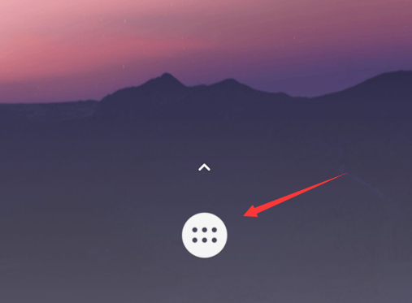
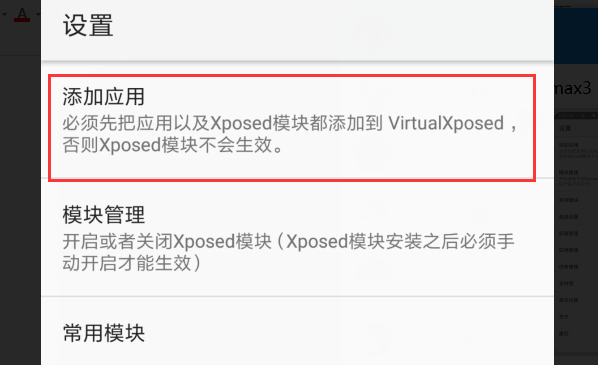
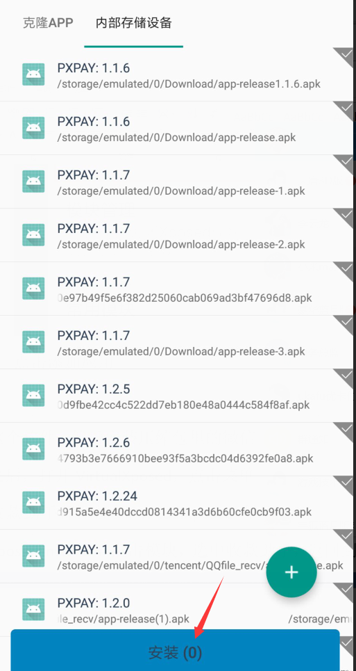
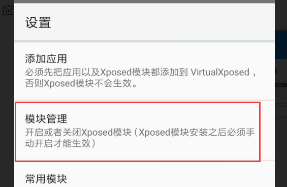
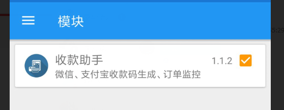
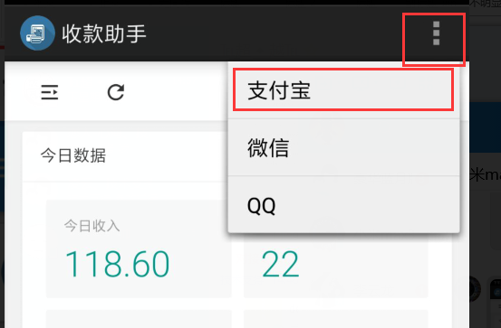
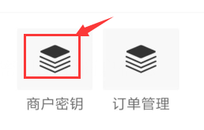

## 安装文档
#### 适用于所有手机.root和没root都行
#### 文件清单:为了保持文档统一,以下软件均未指定版本号
- a)VirtualXposed 虚拟xposed 必选
- b)xppay	收款助手 必需
- c)支付宝 可选
- d)微信 可选
- e)QQ 可选

#### 1.将所有需要安装的软件发送到手机上
#### 2.首先在手机上安装1_VirtualXposed_0.12.7.apk 
##### 这个软件是基础.所有的后续工作都在这个软件里头进行.

#### 3.打开刚安装好的软件.

#### 4.点击这个按钮

#### 5.点击添加应用

#### 6.选中需要安装的程序.点击安装.

##### 重复以上步骤,安装所有必须安装的程序.可选的部分根据自己需求安装:微信/QQ/支付宝.
##### 建议使用支付宝.微信可能会被封号.QQ使用率太低.
#### 7.回到xposed 设置页.选择模块管理,给收款助手打个勾.表示启用.

#### 8.重启xposed
#### 9.打开收款助手

##### 如果前面步骤都正确.此时能看到登陆后的界面.

#### 10.在主界面打开商户密钥.查看商户信息

#### 11.拿到商户密钥之后.开始对接支付接口.